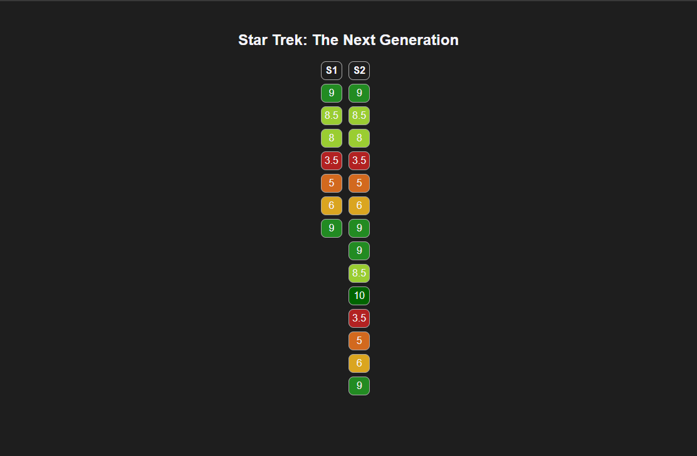

## Introduction

ratingdisplay is console application to turn a plain text file of TV show ratings into a HTML representation.

## Download

Compiled downloads are not available.

## Compiling

To clone and run this application, you'll need [Git](https://git-scm.com) and [.NET](https://dotnet.microsoft.com/) installed on your computer. From your command line:

```
# Clone this repository
$ git clone https://github.com/btigi/asciiz

# Go into the repository
$ cd src

# Build  the app
$ dotnet build
```

## Usage

ratingdisplay is a command line application and should be run from a terminal session. The application requires three parameters in a specific order:

- The text file with the TV show scores
- The HTML template file to load
- The HTML file to output

e.g.

```ratingdisplay D:\st-tng.txt D:\template.html D:\out.html```

The input file is expected to be in the format:

```
Show title
Column title
episode score # comment
episode score # comment
episode score # comment

Column title
episode score # comment
episode score # comment
episode score # comment
```

As an example

```
Star Trek: The Next Generation
s1
9 # I liked this one
8.5
8
3.5  # pretty bad
5
6
9

s2
9
8.5
8
3.5
5
6
9
9
8.5
80
3.5
5
6
9
```

An example output:



## Licencing

ratingdisplay is licenced under the MIT license. Full licence details are available in licence.md